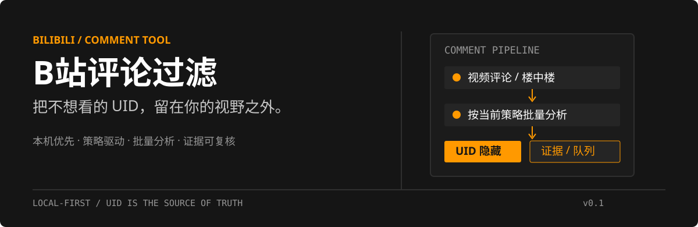
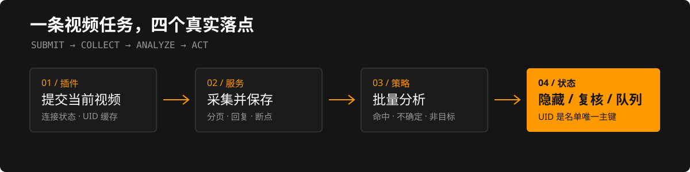

# B站评论过滤

<p align="center">
  
</p>

面向个人 B 站用户的本机优先评论过滤工具。浏览器插件负责提交当前视频和即时隐藏已知 UID；本机服务负责采集评论、按当前过滤策略批量分析、保存证据，并把结果送入复核或可选的官方拉黑队列。

> 这是一个可运行的工程基线。真实评论采集、远程模型输出和官方拉黑仍应使用小规模测试账号与视频单独验收。

## 能做什么

- 在普通 B 站视频评论区隐藏已同步 UID 的根评论和楼中楼，弹幕不处理。
- 提交一个视频任务后异步采集评论，保留分页、楼中楼、断点、覆盖率和失败项。
- 按 UID 聚合后批量调用 OpenAI-compatible 远程模型，减少逐条请求；结果分为命中、非目标和不确定。
- 对命中和不确定结果保存完整评论证据、昵称快照、来源视频、信号、理由和版本信息。
- 在证据收件箱中逐条或批量复核；支持仅本地隐藏、加入例外、撤销和标记显著样例。
- 使用当前过滤策略工作：默认保留“詹黑过滤”，也可以创建广告、剧透、引战等通用策略并切换。
- 只有打开“自动执行官方拉黑”总开关后，队列 Worker 才会按节奏执行官方界面操作。

## 工作流

<p align="center">
  
</p>

| 层 | 负责什么 |
| --- | --- |
| Chromium 插件 | 当前视频提交、连接状态、UID 缓存同步、评论 DOM 隐藏 |
| Python 服务 | 任务编排、B 站评论采集、SQLite 持久化、策略与队列 |
| 远程模型 | 按 UID 批量分析评论上下文，返回结构化判定 |
| 管理页 | 任务详情、证据复核、样本版本、UID 名单和队列控制 |

## 快速开始

### Windows 本机服务

要求：Python 3.11+、Node.js 22+。模型分析需要一个 OpenAI-compatible 远程端点；不配置模型时，本地 UID 隐藏和任务提交仍可用。

```powershell
Copy-Item .env.example .env
# 编辑 .env，至少配置 BILIBILI_FILTER_OPENAI_BASE_URL 和
# BILIBILI_FILTER_OPENAI_MODEL；需要密钥时再配置 API_KEY
.\scripts\start.ps1
```

打开管理页：<http://127.0.0.1:8765/>

首次使用时，在 Chrome 或 Edge 的扩展管理页开启“开发者模式”，选择“加载已解压的扩展”，目录选择构建后的 `dist/extension`。

```powershell
npm install
npm run build
```

之后的日常流程是：打开一个普通 B 站视频 → 点击插件提交当前视频 → 在管理页查看任务 → 在“证据复核”中处理不确定项。页面刷新后，插件会按已同步 UID 缓存继续隐藏评论。

### Docker Compose

```powershell
Copy-Item .env.example .env
# 编辑 .env 配置远程模型和 B 站会话相关参数
docker compose up -d --build
```

服务仍然监听 `http://127.0.0.1:8765/`，SQLite 数据保存在命名卷 `bilibili-filter_bilibili_filter_data` 中。

## 策略、样本与判定

策略决定目标描述、关键词、强命中词、友军例外、恶意上下文和昵称高置信样本。样本按策略版本累积；新任务绑定创建时的策略和样本版本，历史任务不会被新规则回写。

判定结果的实际含义：

- **命中**：立即进入本地隐藏名单；自动拉黑开关打开时进入官方队列。
- **不确定**：立即本地隐藏，并进入证据复核；不会自动执行官方拉黑。
- **非目标**：不更新全局 UID 名单。

高召回策略会优先保留可疑证据，但最终状态仍可以在复核页撤销、加入例外或改为仅本地隐藏。

## 配置要点

常用环境变量见 `.env.example`：

```dotenv
BILIBILI_FILTER_OPENAI_BASE_URL=
BILIBILI_FILTER_OPENAI_API_KEY=
BILIBILI_FILTER_OPENAI_MODEL=
BILIBILI_FILTER_OPENAI_CONTEXT_TOKENS=100000
BILIBILI_FILTER_OPENAI_MAX_OUTPUT_TOKENS=4096
BILIBILI_FILTER_OPENAI_MAX_BATCH_ACCOUNTS=32
BILIBILI_FILTER_BLACKLIST_INTERVAL_SECONDS=60
BILIBILI_FILTER_BLACKLIST_JITTER_SECONDS=30
```

不要提交 `.env`。插件只保存用于离线过滤的 UID 缓存；服务端 SQLite 保存任务、证据、样本版本、复核记录和队列状态。

## 验证

```powershell
npm run typecheck
npm test
.\.venv\Scripts\python.exe -m pytest tests/service tests/e2e -q
```

当前测试覆盖策略闭环、采集分页与断点、批量分析、任务可观察性、证据复核、样本合并、队列控制、插件异步评论隐藏和启动契约。测试使用固定替身，不会替用户执行真实 B 站拉黑。

## 边界与已知限制

- 当前目标是普通 B 站视频评论和回复，不采集、分析或隐藏弹幕。
- AI 分析依赖远程 OpenAI-compatible 端点；本项目不包含桌面端本地 LLM 运行时。
- 真实 B 站接口、登录态、验证码、平台拦截和页面结构会变化；遇到明确风控或验证码时任务应暂停。
- 官方拉黑使用独立、无弹窗的 Chromium 工作实例和可观察队列，不伪造请求或绕过验证。
- 本项目默认面向本机部署；云端部署需要自行处理会话、数据留存和访问控制。

## 许可证

当前仓库尚未声明开源许可证。公开仓库不等于授予复制、修改或分发权利；在正式对外使用前请补充许可证和贡献规则。

